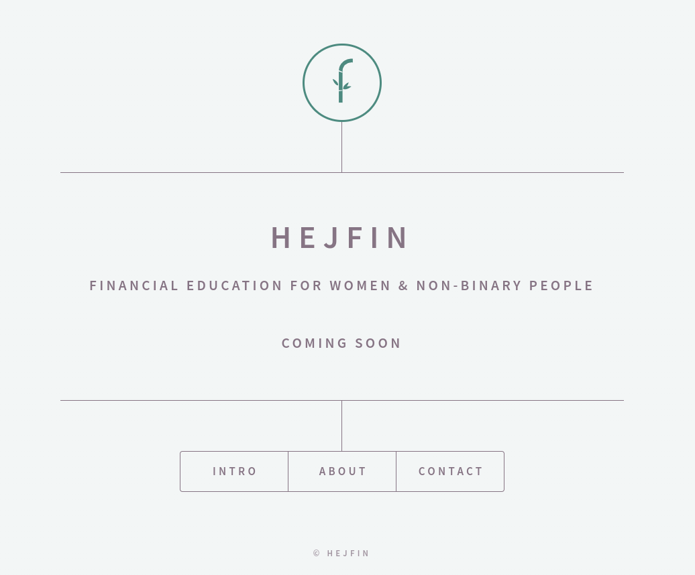

### Website for Hejfin

### Description :
This is a simple layout for the website of Hejfin

### Link to project: https://hejfin.com/

### How It's Made:
Tech used: Html5, scss, javascript.

This is the website for team Hejfin who looks forward to bridge the gap between female(& non-binary population) & finanacial literacy. 

### Lessons Learned:
Used scss to style the templates and got to know it's advantages.
